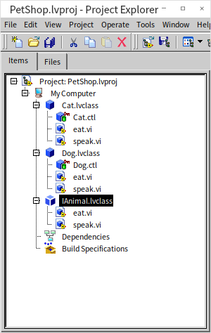
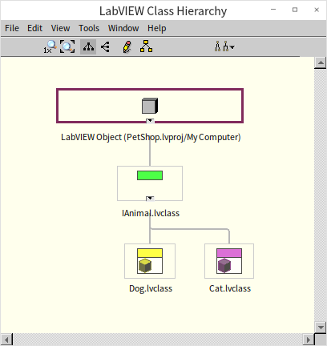
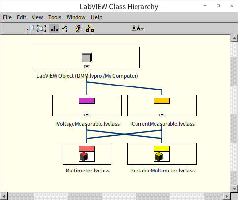

# 设计方法和原则

前面几节在讨论面向对象编程的时候，主要是从实现的角度来考虑的：假设我们已经知道了需要一些类，应该如何为这些类编写代码。但是接下来，我们要换一个角度，来考虑一下如何设计面向对象的程序：对于一个问题，应该设计哪些类，它们之间关系如何？

面向对象编程从根本上说，是为了大规模程序设计的，它的很多方法对于小程序来说，可能并不适合。很多时候它是一种过度设计，因为面向对象编程，在设计时要考虑了软件将来是否容易升级、是否容易扩展功能。这些考虑，对于小程序来说，都属于过度设计。很多小程序可能都是用完就扔了，不存在维护升级的问题。就算将来有了新需求，改起来也很容易，甚至另起炉灶再写个程序也不算费劲。为了个小程序花费太多时间在面向对象设计上的确有些不值。

但是对于大规模程序来说，情况就完全不同了。大规模软件在搭建时，就已经花费了巨大成本，大致它们不会被轻易抛弃。在面临新需求时，一般情况下，都不会再去建立另一个大规模软件。理智的选择必然是，在旧系统上修修补补，进行扩展。因此，在设计大程序的时候，我们就应该已经考虑到了，它将来必然会被扩展。比如，当我们在设计一个宠物店的系统时，就应该考虑到，将来系统中可能会需要添加新的动物种类，新动物种类可能会有一些不同的属性和方法。当我们设计一个学生报告系统的时候，我们需要考虑到将来报告的内容可能需要扩展，比如添加新的学习科目；报告的形式也可能会有新要求，比如可能会需要有 PDF 格式的，网页格式的；报告的形式可能也会扩展，比如有需要邮寄的，有需要打印的等等。当我们设计一个测试系统时，同样也需要考虑将来有可能的扩展，比如可能会需要新的测试项目、新类型的被测产品、新类型的测试仪器等等。

如果在设计阶段不为将来的扩展做好准备，真的等到需要扩展它的时候，工作将会变得非常非常困难。而采用面向对象编程的目的正是为了建立一个最容易维护扩展的系统。再引用一下面之前提到的面向对象编程的目的：创建一个既灵活又稳定的系统：灵活体现在可以随时添加新的功能；稳定性体现在它不需要改动已有的类。那么，如何做到在不修改已有代码的基础上再增加新功能呢？

在前文中，我们已经详细介绍了面向对象编程的三大特性：[封装](oop_basic#封装数据抽象)、[继承](oop_basic#继承)、[多态](oop_basic#多态动态绑定)。在设计程序时，这三大特性亦然是最重要的考量因素，也就是说，在设计类时，我们需要考虑类中有哪些属性和方法，是否可以继承其它一些类中的属性和方法等。除此之外，还有一些比较常用的设计方式和技巧可以考虑，比如一个类是否需要依赖到另一个类，一个类是否是由其它一些对象组成的等等，我们将在下文介绍这些技巧。

此外，计算机科学家 Robert C·Martin 在 2000 年提出了面向对象程序设计的几条原则。后来经过更多专家的修改提炼，这些原则被总结成了五条在面向对象程序设计时应该遵守的准则和最佳实践，被称为 SOLID 原则。这些原则是：

- S - 单一功能原则 (Single Responsibility Principle, SRP)
- O - 开放封闭原则 (Open/Closed Principle, OCP)
- L - 里氏替换原则 (Liskov Substitution Principle, LSP)
- I - 接口隔离原则 (Interface Segregation Principle, ISP)
- D - 依赖倒置原则 (Dependency Inversion Principle, DIP)

这五条原则非常重要，我们也将在下文一并介绍。需要注意的是，这五条原则的排列顺序是为了凑成英文单词 solid （坚实的），我们在介绍这些原则的时候，会打破这个顺序，先从基础的原则开始讲解。

## 抽象

抽象（Abstraction）这个概念在前文已经介绍过多次了，它是指从多个个体中抽取出共同点，形成一个更通用、更概括的概念或模型。比如，从众多的狗的个体中提取出共同点，抽象成“狗”类，就是一种典型的数据抽象。在设计程序的时候，我们还要更进一步，需要从多个不同的类中抽取出共同的特性，形成一个更通用的接口。在这个接口中，我们定义共同的属性和行为，但不必关注具体的实现细节。通过抽象，可以让设计出来的系统降低复杂性。通过隐藏不必要的细节，只展现最关键的特性，抽象可以让我们更容易理解和设计系统。并且通过定义通用的属性和行为，可以避免在多个地方重复相同的代码。在基于抽象的结构上，将会更容易进行扩展或重写，形成各种具体的子类。

比如：当我们考虑设计一个宠物店的系统时，在这个系统中，有多种动物，如猫、狗。尽管这些动物有很多不同的特性，但它们也有一些共同点。例如，每种动物都有一个名字，都需要吃食物，都可以发出声音。这些共同点，就可以抽象成为一个“动物”接口：

在这个 IAnimal 接口中，我们定义了共同的方法 set_name, eat 和 speak。但是，我们并没有为这些方法提供具体的实现。在这一步抽象完成之后，我们可以基于这个抽象的 Animal 接口，再去定义具体的动物类。项目最终的继承关系如下：

每个具体的动物类都实现了 IAnimal 接口，并为 speak 方法提供了具体的实现。通过这样的设计，我们可以轻松地向系统中添加更多的动物种类，而不必每次都从头开始定义共同的属性和行为。这就是抽象的威力所在。

与上面示例相似，当我设计一个学生报告系统的时候，需要考虑一下，各种不同类型的报告是否有共同点（比如都可以打印？都可以邮寄？）可以提取出来；在设计一个测试系统时，也需要考虑，不同的仪器之间有哪些共同点可以提取，不同的测试项目间有哪些共同点。

## 里氏替换原则

里氏替换原则是指，子类型必须能够替换它们的父类型而不会导致任何错误。

换句话说，如果有一个父类的实例，我们应该能够将它替换为它的任何一个子类的实例，并且应用程序仍然应该正常工作。如果违反了里氏替换原则，我们就不能放心的把子类放在任何调用父类的地方，这样降低了代码的可重用性。如果不小心在程序中使用了这样的子类，又要确保程序可以运行无误的话，那就要以增加测试和维护成本为代价。

假设我们在编写测试程序时，使用到了两个种类的万用表：一种是比较普通的，我们为它定义了一个类 Multimeter；另一种是便携式的万用表，考虑到这是一种特殊的万用表，而且功能与普通万用表高度重合，于是我们把它定义为 Multimeter 的一个子类 PortableMultimeter。

在生活常识中，这样的分类没有任何问题。但是程序项目中，一旦我们把 PortableMultimeter 定义为 Multimeter 的子类， PortableMultimeter 就很有可能被别人把拿去当做 Multimeter 使用。但是便携式万用表的功能很可能无法完全替代普通万用表，比如，便携式万用表的测量范围可能小于普通万用表，或者测量精度低于普通万用表，这样就会导致程序有运行出错的风险。也就是说，把 PortableMultimeter 定义为 Multimeter 的子类违反了里氏替换原则。

为了遵循里氏替换原则，我们可以重新设计这两个类，使得 PortableMultimeter 不是 Multimeter 的子类，而是两者都是更通用的一些接口的子类。比如，我们可以暂时定义一个 IMultimeter 接口，继承关系如下：

如此一来，PortableMultimeter 和 Multimeter 都是实现了 的类。它们之间没有了子类和父类的关系，是两个平等独立的类。我们在程序里也就不用担心有人使用 PortableMultimeter 去替代 Multimeter，因此不再违反里氏替换原则。从这个示例中，我们可以看到：面向对象编程中的类，本质上是为软件开发服务的，在设计类，设计类与类之间的关系时，最主要考虑程序的是程序的逻辑关系，而不是这些事物在现实世界中的关系。

## 依赖关系

依赖（Dependency）关系是一种比较散的联系，它表示一个类在其方法中使用了另一个类的对象。如果甲类的方法操纵了乙类的对象，那么甲类就依赖于乙个类。与下文将要介绍到的组合和聚合等关系不同，依赖关系没有强烈的生命周期的含义。比如，考虑一个简单的情况：我们有一个 Printer 类（打印机），可以打印各种文档。我们还有一个 Document 接口（文档），它代表要打印的文档。在这种情况下，Printer 类依赖于 Document 接口，因为它需要一个 Document 实例来执行打印操作。

。。。。。。。。。

在这个例子中，Printer 类有一个方法 print_document，该方法接受一个 Document 接口的对象作为参数并打印其内容。这意味着 Printer 依赖于 Document，因为它需要 Document 对象来执行其操作。但请注意，这种依赖关系并不意味着 Printer 拥有 Document，或者 Document 的生命周期取决于 Printer。它只是表示 Printer 类在其某些操作中使用了 Document 接口。

这种关系是临时的，只存在于方法调用期间。

## 依赖倒置原则

依赖倒置原则是指，一个类不应该依赖其它的类，它应该依赖接口。

传统的面向过程的程序设计中，总是上层模块依赖于下层模块。我们自然的想法也是：既然抽象概念都是从具体事物中提取出来的，那么它们应该依赖于具体事物。这个原则之所以被称为“倒置”，是因为它的主张正与之前的想法正相反：“抽象不应该依赖具体，而是具体依赖抽象”，上层的类也不应该依赖底层的类，无论上下层的类，它们都应该依赖接口。

虽然这个原则被 SOLID 排在了最后，但它却是其它原则和设计方法的基础。依赖倒置原则的核心是通过依赖抽象，让各个类之间不直接相互作用，这样可以降低它们之间的耦合度。低耦合度意味着一个类的改动不影响到其它类，从而降低了维护和扩展的难度。

为了更好地解释这个原则，我们考虑下面的报告生成的示例。假设我们有一个 ReportService 类，它直接依赖于具体的 PDFStudenReport 类来生成 PDF 报告：

。。。。。。。。。。。。。。。。。

上面这个设计的问题在于： ReportService 直接依赖于 PDFStudenReport。当需求发生变动的时候，比如要求生成一个 Web 格式的报告，我们就必须要修改 ReportService 类。为了遵循依赖倒置原则，我们可以定义一个抽象的 Report 接口，然后让 PDFStudenReport 和其他报告类型（如 WebStudentReport）实现这个接口。ReportService 应该依赖于这个抽象接口，而不是具体的实现。

。。。。。。。。。。。。。。。。。

现在，ReportService 类通过其构造函数接收一个 Report 接口的实例。我们可以轻松地更改报告的类型，只需要提供一个不同的 Report 实现即可，而不需要修改 ReportService 类。

## 单一功能原则

单一功能原则，简单的说就是一个类只做一件事。

多大的事才算是“一件事”呢？更具体点说，一个类只负责一件事，表示当用户或老板对软件的需求有所改变时，只有其中一条需求改变了，我们才需要改变类的设计。比如，编写一个程序，管理学生的信息，这个程序需要从数据库读取学生的信息，也需要把信息按一定格式打印出来。我们有一些不同的方法来设计程序中的类，比如 设计一个 Student 类，它有两个方法：一个负责动数据库读取信息，并把数据保存成相应的属性；另一个方法负责读取保存的属性，然后打印成报告：

。。。。。。。。。。。。。。。

上面这个设计方法就违反了单一功能原则，因为 Student 类同时做了两件事：管理学生数据和报告生成。将来，无论是对于学生数据的管理方式发生变化，还是报告格式有了新要求，都需要改动这个类。遵循单一功能原则的设计应该把这两个功能分别放置到不同的类和接口中去：

。。。。。。。。。。。。。。。

在遵循单一功能原则的设计中，我们将报告生成的责任移到了一个单独的 StudentReport 类中。这样，如果数据管理方式发生变化，Student 类可以独立于报告生成进行更改，反之亦然。

为什么要遵循单一功能原则呢？

首先，大型项目会有多人，甚至多个团队参与。不同的功能可能会由不同的人来负责开发维护。如果不同功能的变动影响到了同一个类，那么就有可能在做修改时出现冲突。其次，单一功能原则可能让程序代码的版本管理更清晰，一个功能对应一个类、一个文件，这样，某个文件一发生更新，我们就知道是哪个功能出现了变化。反之亦然，当需要改变一个功能时，我们可以直接找到对应的文件。

## 接口隔离原则

接口隔离原则，简单的说就是，我们应该确保一个类不会被迫实现它不需要的接口。如果一个接口被定义的过于复杂，包含了各种不同的功能，那么实现了这个接口的类，就必须实现每一个在接口中定义了的功能。即便这个具体类只需要做一件事，它也不得不实现抽象类中定义的其它的不相关的功能。因此，设计抽象类的时候，应当尽量把每个特定的功能都设计成一个接口，这样好过一个大的通用的接口。如此，每个具体类才可以只关注与它直接相关的功能。

我们还是以 StudentReport 类为例，在这个示例中 StudentReport 是一个接口，我们要实现一些更复杂的报告功能，包括：生成报告、发送报告和打印报告等功能。我们编写了一个具体类 PDFStudenReport 负责处理 PDF 格式报告的相关功能，它实现了 StudentReport 接口。PDFStudenReport 实现了生成、电子邮寄、打印 PDF 报告的功能：

。。。。。。。。。。。。。。。。。。。

现在又有了新的需求：一个新的报告格式，以网页格式生成和 Email 报告，但是不需要打印报告的功能。我们可以再实现一个新的具体类，WebStudentReport， 它能够生成和电子邮寄网页格式的报告：

。。。。。。。。。。。。。。。。。

在上面示例中，WebStudentReport 负责处理 Web 格式报告的相关功能，它继承了抽象类 StudentReport。WebStudentReport 本不需要打印功能，可是由于 StudentReport 抽象类中有这个方法，WebStudentReport 也不得不实现它。这就违反了接口隔离原则。

为了遵循接口隔离原则，我们可以将 StudentReport 接口拆分为多个针对每个具体功能的接口：

。。。。。。。。。。。。。。。。

这样，WebStudentReport 只需要实现与其真正相关的接口，而不是被迫实现一个不需要的方法。这样我们遵循了接口隔离原则，确保每个类只实现它们真正需要的接口。

## 关联

关联（Association）定义了一个类中的对象与另一个类中的对象之间的连接。这种连接可以是单向的或双向的，并且可以有不同的“强度”或持续时间，从暂时性的到长期性的。设计关联的时候，需要关注两个特性：首先考虑单双向，它指定了两个类之间的双向或单向关系。例如，如果 A 类知道 B 类，而 B 类不知道 A 类，那么这是单向关联。其次是多重性，一对象是否与另一个类的多个对象相关联。

比如，一个学校系统，其中有 Teacher 和 Student 两个类。这两个类的对象的关系是一种“关联”关系：一个老师可以教多个学生，而一个学生可以被多个老师教。

。。。。。。。。。。。。

上面的例子中，Teacher 和 Student 之间的关系是双向的，并且有明确的多重性，因为一个老师可以有多个学生，而一个学生可以有多个老师。在 Teacher 类中，相关联的 Student 对象被保存在一个列表中。使用 add_student() 方法可以建立这种双向关系。通过这样的设计，我们可以很容易地查询和操作对象之间的关联，例如，查询一个老师的所有学生或查询一个学生的所有老师。

## 组合

组合（Composition）是一个指代“整体-部分”关系的概念。当一个对象包含另一个对象的一个或多个实例，我们称这种关系为组合。组合允许我们构建更复杂、功能丰富的对象，它基于现有对象而不需要继承它们。相较于继承，组合提供了更高的灵活性。通过简单地更改组件，我们可以改变整体的行为。组合有助于解耦系统的各部分。每个组成部分可以独立地进行开发和测试。组合可以将复杂的系统分解成容易理解和管理的部分。

假设，我们要模拟小狗，设计一个 Dog 类，其中狗由头部、身体、四条腿和一条尾巴组成。腿由多个关节组成，如髋关节、膝关节等。在这个设计中，“狗”与“头”之间的关系，就不应该是继承，而是组合：“狗”由“头”、“身体”、“尾巴”等组合而成。

首先，定义关节、腿、尾巴等身体部件的类：

。。。。。。。。。。。。。。。。。。。。

随后，创建 Dog 类，每一个 Dog 对象将使用四个 Leg 接口的实例和一个 Tail 接口的实例：

。。。。。。。。。。。。。。。。

现在，当我们需要狗行走时，我们只需调用 walk 方法。当狗表达开心时，我们可以调用 express_happiness 方法。

。。。。。。。。。。。

通过组合，我们为 Dog 类提供了各种功能，同时保持代码的组织性和可维护性。如果未来需要修改狗的腿的结构或关节的行为，我们只需在相应的类中进行更改。

## 聚合
聚合（Aggregation）表示一个类是另一个类的部分或组成部分。这种关系代表了"拥有"的语义，即一个对象可以拥有或包含其他对象。聚合通常用于表示整体和部分之间的关系，其中整体不必负责部分的生命周期。只有聚合类知道部分类，而部分类不知道聚合类。部分对象可以在一个聚合对象移动到另一个聚合对象。

聚合与组合的方法有些类似，它们都可以表示“部分”和“整体”，“整体”拥有一个或数个“部分”。差别之处在于“整体”是否负责“部分”的生命周期，也就是是否负责管理“部分”的创建与销毁。比如说，“尾巴”是“狗”的一部分，当一个狗的对象不存在了，尾巴对象也没有存在的必要，“狗”负责创建和销毁“尾巴”，这就是组合；另一个例子，“学生”也可以看做是“教室”的一部分，但是，在“教室”之外，应用程序可能还会需要“学生”完成其它一些任务，比如体育活动等等，也就是说，“学生”对象的生命周期不能由“教室”负责，这样学生和教室之间的关系就是聚合，而不是组合。

。。。。。。。。。。。。。

上述例子中，Classroom 类聚合了 Student 类。教室保存了其内部的学生，但学生也可以在没有教室的情况下存在。通过使用聚合，我们可以建立清晰的层次结构和整体-部分关系，这有助于在更高的逻辑级别上组织和管理系统中的对象。

## 开放封闭原则

开放封闭原则是指：类应该对扩展开放，对修改封闭。

说的具体一点就是，我们应该在不修改现有代码的前提下添加新的功能。任何对代码的改动，都可能会引进新的 bug，导致程序不稳定。因此，已经在运行的没问题的代码，应该能不动就不动。

这是我们在这一节介绍的最后一个原则，之所以用来来压轴，是因为这个原则正是我们在软件开发中引入面向对象编程的目的：我们希望创建一个既灵活又稳定的系统：灵活体现在可以随时添加新的功能；稳定性体现在它不需要改动已有代码。所以这是最重要的一个原则，而之前介绍的方法和原则都是为了实现这一目标的铺垫。这个原则不仅仅是针对“类”，实际上，设计任何软件实体，包括类、模块、函数等都应该对扩展开放，但对修改封闭。

我们继续使用 StudentReport 来讲解，这是已经写好的代码：

.................

接下来，我们收到了新的需求：打印报告需要使用结构化的数据，以字典格式返回。我们可能会这样修改程序：

...............

这种修改方法就违反了开放封闭原则，因为我们不断地修改 StudentReport 类来支持新的报告格式。那么怎么才能不改变已有的类，又添加新功能呢？

这需要使用到抽象类：我们可以引入一个抽象的“报告生成器”类，然后把每一种格式的报告设计成一个具体类：

............

现在，当需要添加新的报告格式时，只需添加以中新的具体的报告生成器类就可以了，而无需修改现有的任何类。修改后，使用 ReportGenerator 的的示例代码：

..................

如此，当我们需要生成不同格式的报告时，只需改变 UserReport 实例的生成器即可。例如：

.............

这种设计完全遵循了开放封闭原则，因为现有的代码不需要为了添加新功能而进行修改。

