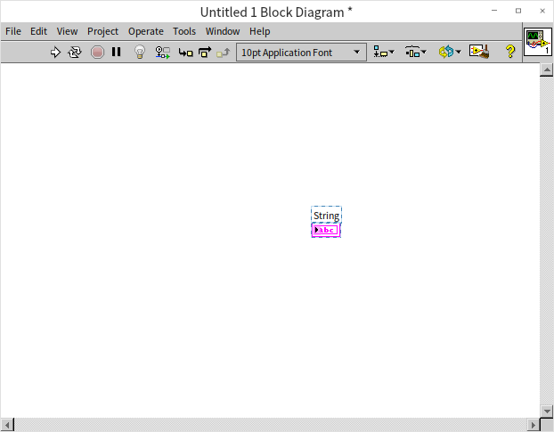
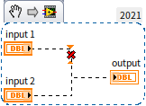
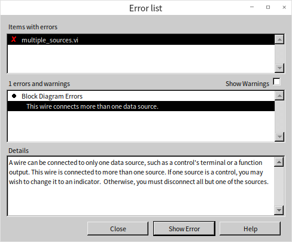

# Hello，World!

Many books on computer programming languages start by guiding readers to write a "Hello, World!" program. This entails writing a piece of code that, upon execution, displays the phrase "Hello, World!" on the screen. Embracing this tradition, we'll also begin our LabVIEW journey with a "Hello, World!" program as our first project.

## LabVIEW Startup Interface

Upon launching LabVIEW, you're greeted with its startup interface. The startup screens of LabVIEW vary in style across different versions, as illustrated in the images below, representing the startup screens of LabVIEW 8.6 and LabVIEW 2021:

Despite these stylistic variations, the LabVIEW startup interface consistently includes several key elements:

- The "New" section is designated for creating new LabVIEW program files. LabVIEW programs incorporate a variety of file types, including VI, XControl, libraries, classes, global variables, run menus, and custom controls, among others. These will be detailed in the following chapters.

- The "Open" section displays a list of recently opened projects and files. For those who have just installed LabVIEW, this area will initially be empty.

## Creating a New VI

LabVIEW programs are stored in files known as "VIs" (Virtual Instruments). LabVIEW was invented in 1986, with its initial purpose being to simulate test and measurement instruments. By integrating a computer with relevant data acquisition cards and LabVIEW software, it was possible to create a virtual instrument capable of performing specific measurement functions. Thus, LabVIEW's source code files were aptly named "Virtual Instruments", bearing the file extension ".vi", an acronym for Virtual Instrument. Fast forward several decades, LabVIEW's application scope has vastly expanded, encompassing areas like testing, measurement, control, and simulation, yet the term VI remains. Today, a VI can be perceived as a LabVIEW code module that performs specific functions, akin to a function in other programming languages.

To initiate a new VI, select "New -> VI" from the LabVIEW startup interface or opt for "File -> New VI" from the menu. This action will open two new windows on your screen: one featuring a gray background:

And the other with a white background:

These windows represent a freshly created blank VI, devoid of any code. You can resize these windows by moving your mouse to their edges until the cursor turns into a double-headed arrow, then click and drag to adjust.

A VI is comprised of two main components: the "Front Panel" with a gray background and the "Block Diagram" against a white backdrop. The Front Panel serves as the user interface for interaction with the program, where users can input necessary parameters and view execution results. The Block Diagram is the space for writing the program code, which dictates the program's logic and execution flow.

## Editing the Front Panel

We're now set to begin crafting our first LabVIEW program, starting with designing its interface, which involves editing the VI's front panel.

When the front panel is the active window in LabVIEW, another floating window, known as the LabVIEW Controls Palette, may appear:

Sometimes, this active window might not be open initially. If this is the case, right-clicking on an empty space within the VI's front panel will cause the Controls Palette to pop up:

If you find it useful, you can pin the Controls Palette to ensure it's always visible when working on the VI front panel by clicking the pin icon in the top-left corner of the palette. However, if you find it obstructive, you have the option to close it and make it appear only when needed by right-clicking.

Although the appearance of the Controls Palette may vary slightly across different LabVIEW versions, its functionality and usage remain consistent. It organizes a range of controls along with their icons into categories. Some of these categories might be collapsed; expanding them will reveal the specific controls or further subcategories they contain. The types and purposes of most controls can be readily identified from their icons. For interface design, the necessary controls are selected directly from the Controls Palette.

Our program is designed to display text, which means we need to select a text or string display control for the front panel. On the Controls Palette, the first row typically contains subclasses for numeric, Boolean, and string controls. By clicking on the third column of icons in the first row, which pertains to text display categories, we can access its sub-palette:

Proceed by selecting the "String Indicator" control. Clicking on the VI's front panel will place the control there. Alternatively, you can drag and drop the selected control to a specific location on the front panel.

Hovering the cursor over the edge of the newly placed control will display eight small dark squares along its border.

When the cursor is at the edge of the control, it changes to the standard arrow shape, allowing you to drag the control to a new position by pressing the left mouse button. If the cursor is positioned over one of the small dark squares, it turns into a two-way arrow for resizing the control. Once the control is adjusted to the desired size and location, the interface for our first VI is all set.

## Editing the Block Diagram

The block diagram is where the logical functionality of a LabVIEW program is realized. Placing a control on the VI's front panel automatically adds a corresponding terminal to the VI's block diagram:

Data directed to this terminal in the block diagram will be displayed by the corresponding control on the front panel during the program's execution. For instance, if we send the string "Hello World!" to the terminal labeled "String," the "String" control on the interface will show these words when the program is run.

With the VI block diagram window active, a floating window resembling the Controls Palette may appear (or can be summoned by right-clicking on a blank area of the block diagram). This window is the Functions Palette. The Functions Palette operates similarly to the Controls Palette but differs in that it features icons representing functions, structures, constants, and built-in VIs within LabVIEW that are essential for controlling the execution of the program. Our task now is to locate a string constant to store the "Hello World!" text.

In a manner akin to using the Controls Palette, click on the icons in the Functions Palette and navigate to "Programming -> String" to find the String Constant:

Drag the string constant onto the VI block diagram. You can immediately start typing on the keyboard to enter text into the string constant.

LabVIEW uses wires for data transfer. Position the cursor to the right-middle side of the string constant, and the cursor will transform into a spool-like icon. Clicking in this state will initiate a wire from the string constant. Then, clicking at the middle left side of the terminal on the String display control will establish a wired connection between the two elements.

With this wiring, our entire program is now ready. To execute the VI, click on the first arrow-shaped button located on the left side of the toolbar on the front panel. The execution results of the program will be visible on the VI front panel:

Should there be any errors in the program, the run button's arrow on the toolbar will turn into a broken shape, indicating that the program cannot be run. The button's label will also change from "Run" to "List Errors." Clicking this button will display a dialog box listing the errors. These errors need to be addressed as per the prompts in the list, and the program code should be accordingly modified. The program can only be executed once the run button reverts to its regular arrow form.

As this is our initial foray into LabVIEW programming, it's good practice to save the program. To do so, select "File -> Save" from the menu or use the shortcut "Ctrl+S," then choose an appropriate path and filename to save the VI.

This simplicity is what makes LabVIEW programming so accessible and easy to learn!

## The Execution Logic of LabVIEW Programs

In the realm of programming, most prevalent languages are text-based. For instance, languages like VC and C# feature what-you-see-is-what-you-get (WYSIWYG) editing for interfaces, yet the logic behind them is scripted in text. Some graphical programming languages, such as Scratch (as detailed in the "[Other Programming Languages](appendix_languages)" section), employ graphical representations to depict code logic but still follow a procedural approach akin to traditional procedural text-based programming languages like C.

Contrastingly, LabVIEW stands out significantly from these text-based languages. It not only allows for graphical interface editing but also adopts a unique "drawing" method for implementing programming logic. The primary focus in LabVIEW programming is on how data flows among code segments, rather than the procedural problem-solving process typical in other languages. To aid in comprehending the distinctions between LabVIEW and conventional text-based languages, this book will frequently draw comparisons between LabVIEW and languages such as C and Java.

Owing to its graphical programming nature, LabVIEW is sometimes mistakenly likened to graphical design and control applications like CAD or specific software used for designing circuit boards and chemical machinery. However, the versatility and powerful features of LabVIEW surpass those of standard industry applications, affirming its status as a true programming language.

For a clearer explanation of LabVIEW programming, it's essential to define some commonly used terms. All graphical elements within the VI's front panel and block diagram are termed as **objects**. On the VI front panel, the most prevalent graphical objects are **controls**, utilized for data input or display. Occasionally, the front panel may also contain other types of objects, such as decorative lines or images, which don’t play a role in the program's execution. Within the VI block diagram, graphical objects can be categorized into two main groups: **nodes** and **wires**. Wires, also known as data lines, are responsible for connecting control terminals, exemplified in the simple program we previously crafted. Wires are easily distinguishable within the block diagram. Conversely, all other block diagram entities are collectively identified as nodes.

Nodes in LabVIEW can be categorized into several distinct types:

- **Terminals:** As mentioned earlier, terminals correspond to controls on the VI front panel, serving to read or write data from these controls. Much like parameters in text-based programming languages, data exchange in LabVIEW occurs through these terminals.
- **Functions:** These are fundamental nodes in LabVIEW that carry out basic, non-divisible tasks, similar to operators and built-in library functions in text-based languages. For example, LabVIEW's addition function ()  parallels the "+" operator in text languages, while its string length function () can be compared to the strlen() function in C or len() function in Python.
- **Structures:** Structures in LabVIEW dictate the sequence of program execution, akin to the flow-control keywords in text-based languages. For example, the for loop structure in LabVIEW () is similar to the for statement in C or Python.
- **Sub VIs:** These are essentially VIs called within another VI, functioning similarly to subfunctions in text programming languages.
- **Decorations:** The block diagram of a VI might also include decorative nodes that do not impact program execution, such as background images or explanatory text. These are akin to comments in text-based languages and serve to enhance the readability and comprehension of the code.
 
In most text-based languages, the basic execution order of a program typically follows the sequence in which the statements are written. Without any flow-altering jump statements, the program executes each line of code sequentially from top to bottom. In contrast, LabVIEW's execution order is governed by the wiring on the block diagram, meaning the program executes along the paths defined by these wires.

The execution logic of LabVIEW programs can be understood as follows:

Data originates from a source node on the block diagram and follows the connecting wire to an input terminal of the subsequent node. After processing at this node, the data exits through the node's output terminal and continues along the wire to the next node. This flow persists until the data reaches a terminal node. Thus, the sequence of data flow dictates the execution order, characterizing LabVIEW programs as dataflow-driven.

The figure above illustrates a simple mathematical operation program. In a basic VI, data typically originates and terminates at the control terminals. Data moves from the "input" terminal, travels along the wire to the "Increment" function, exits from the right side of the "Increment" function, proceeds through the wire to the "Square Root" function, and finally enters the "result" terminal.

The reason data flows out of "input" and into "result", although both are terminals, is due to the dual nature of controls in LabVIEW. They can be configured either as a control or an indicator, which dictates the direction of data flow. When configured as a control, data flows out from its terminal; as an indicator, data flows into its terminal.

By default, the function of a control as either a control or an indicator is determined by the properties of the physical entity it represents. For instance, a switch control typically serves as a control, while a lightbulb control usually acts as an indicator. Changing a control’s data flow direction can be done by right-clicking on it and selecting the "Change to Control/Indicator" option from the context menu.

Functions and sub VIs generally possess multiple terminals, each with a fixed direction. Data invariably flows into functions via their input terminals and exits through their output terminals.

Wires are capable of branching. Data flowing out of one terminal can simultaneously be directed to several receiving terminals. Upon reaching a junction on a wire, the data is automatically duplicated, creating two identical and independent sets of data, each traveling to their respective subsequent nodes. These nodes then process the two data sets independently. (This description is simplified for clarity; LabVIEW doesn't always duplicate data at every branch. More detailed explanations will be provided in later sections of this book.) As demonstrated below:

Conversely, a receiving terminal cannot concurrently receive data from different sources. Attempting such a connection will result in the wire turning into a dashed line:

In such cases, clicking the "List Errors" button (which also functions as the "Run" button) on the VI block diagram window’s toolbar will display an error message:

## Practice

- Create a new VI, place a switch control and a lightbulb control, and then use the switch to control the turning on and off of the lightbulb.